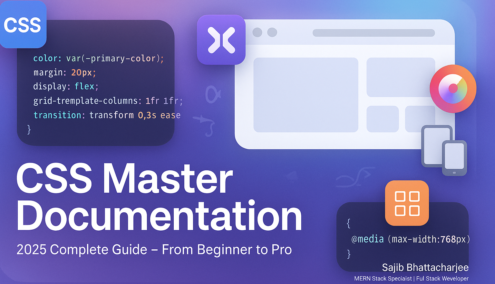

<p align="center">
  
</p

# ✨ The Ultimate CSS Documentation (2025 Professional Edition) ✨

Welcome to the definitive guide to Cascading Style Sheets. This documentation is meticulously crafted to be the most comprehensive resource available, taking you from fundamental principles to the most advanced, modern techniques. It is packed with detailed explanations, real-world examples, visual diagrams, and interactive learning links to elevate your skills.

---

### 📘 **Table of Contents**

1. [Introduction to CSS](#1-introduction-to-css)
2. [CSS Selectors](#2-css-selectors)
3. [The Box Model](#3-the-box-model)
4. [Color and Background](#4-color-and-background)
5. [Fonts and Text](#5-fonts-and-text)
6. [Display and Visibility](#6-display-and-visibility)
7. [Positioning and Z-Index](#7-positioning-and-z-index)
8. [Flexbox Layout](#8-flexbox-layout)
9. [Grid Layout](#9-grid-layout)
10. [Multi-Column Layout](#10-multi-column-layout)
11. [Float and Clear (Legacy)](#11-float-and-clear-legacy)
12. [Styling Tables](#12-styling-tables)
13. [Transitions and Animations](#13-transitions-and-animations)
14. [2D & 3D Transformations](#14-2d--3d-transformations)
15. [Filters and Effects](#15-filters-and-effects)
16. [Object Fitting and Aspect Ratio](#16-object-fitting-and-aspect-ratio)
17. [CSS Functions](#17-css-functions)
18. [CSS Variables (Custom Properties)](#18-css-variables-custom-properties)
19. [Appearance and UI Styling](#19-appearance-and-ui-styling)
20. [Scroll and Overflow Control](#20-scroll-and-overflow-control)
21. [Cursor and User Interaction](#21-cursor-and-user-interaction)
22. [Generated Content & Counters](#22-generated-content--counters)
23. [CSS Resets and Normalization](#23-css-resets-and-normalization)
24. [Advanced CSS Concepts](#24-advanced-css-concepts)
25. [Responsive Design & Media Queries](#25-responsive-design--media-queries)
26. [Print and Paged Media](#26-print-and-paged-media)
27. [Custom Scrollbar Styling](#27-custom-scrollbar-styling)
28. [Deprecated or Obsolete Properties](#28-deprecated-or-obsolete-properties)
29. [Experimental and Draft Features](#29-experimental-and-draft-features)
30. [Developer Tools and Workflow](#30-developer-tools-and-workflow)
31. [CSS Performance and Optimization](#31-css-performance-and-optimization)
32. [Accessibility (A11y) in CSS](#32-accessibility-a11y-in-css)
33. [Appendix: References & Globals](#33-appendix-references--globals)

---

## 1\. Introduction to CSS

CSS (Cascading Style Sheets) is the cornerstone of web design. It's the language used to describe the presentation of a document written in a markup language like HTML. CSS separates the content from presentation, leading to cleaner code, easier maintenance, and more powerful design capabilities. 🎨

- **Cascading**: Styles "cascade" down from multiple sources. The browser has a complex algorithm, called the **cascade**, to determine which styles apply to an element. This includes browser default styles, user-defined styles, and author styles (your stylesheet).
- **Sheets**: Styles are typically collected in `.css` files, referred to as stylesheets.

📌 **Basic Syntax**
A CSS rule is composed of a selector and a declaration block.

```css
selector {
  /* Example: h1 */
  property: value; /* Example: color: blue; */
}
```

🔍 **Example**
This rule targets all `<p>` elements and sets their color and line height.

```css
p {
  color: #333;
  line-height: 1.6;
}
```

> ✅ **Tip**: Always link your external stylesheet in the `<head>` of your HTML document for best performance: `<link rel="stylesheet" href="styles.css">`.

---

## 2\. CSS Selectors

Selectors are patterns that select the HTML elements you want to style. Their mastery is essential for efficient and clean CSS.

### **Common Selectors**

| Selector Type      | Syntax                 | Example                 | Description                                    |
| :----------------- | :--------------------- | :---------------------- | :--------------------------------------------- |
| **Type**           | `element`              | `h2 { ... }`            | Selects all elements of a given type.          |
| **Class**          | `.className`           | `.btn { ... }`          | Selects all elements with a specific class.    |
| **ID**             | `#idName`              | `#header { ... }`       | Selects one unique element with a specific ID. |
| **Attribute**      | `[attr]`, `[attr=val]` | `[type="submit"]`       | Selects elements based on an attribute/value.  |
| **Universal**      | `*`                    | `* { box-sizing: ... }` | Selects all elements. Use with care.           |
| **Pseudo-class**   | `:pseudo-class`        | `a:hover { ... }`       | Selects elements in a specific state.          |
| **Pseudo-element** | `::pseudo-element`     | `p::first-line { ... }` | Selects and styles a part of an element.       |

### **Combinators**

Combinators allow you to create more specific selections by defining the relationship between simple selectors.

- **Descendant (`     `)**: `article p` (selects any `<p>` inside an `<article>`)
- **Child (`>`)**: `article > p` (selects any `<p>` that is a _direct child_ of an `<article>`)
- **Adjacent Sibling (`+`)**: `h1 + p` (selects the first `<p>` immediately after an `<h1>`)
- **General Sibling (`~`)**: `h1 ~ p` (selects all `<p>` elements that are siblings of and come after an `<h1>`)

---

### **Real-World Example**

Let's style a link inside a navigation bar's active list item, but only if it doesn't have a specific `disabled` attribute.

```html
<nav>
  <ul>
    <li><a href="#">Home</a></li>
    <li class="active"><a href="#">Products</a></li>
    <li><a href="#" disabled>Contact</a></li>
  </ul>
</nav>
```

```css
/* Selects the <a> inside the .active <li> which is inside the <nav> */
nav .active > a:not([disabled]) {
  font-weight: bold;
  color: dodgerblue;
  text-decoration: none;
}
```

> ⚠️ **Note on Specificity**: ID selectors (`#id`) are highly specific and can be hard to override. Prefer class selectors (`.class`) for general styling to keep your CSS manageable.

---

## 3\. The Box Model

Every HTML element can be considered a rectangular box. The CSS box model is the set of rules that defines how this box's size is calculated and how it interacts with other boxes. 📦

### **Visual Diagram**

```
      +---------------------------------------------------+
      |                      Margin                       |
      |   +-------------------------------------------+   |
      |   |                   Border                  |   |
      |   |   +-----------------------------------+   |   |
      |   |   |              Padding              |   |   |
      |   |   |   +---------------------------+   |   |   |
      |   |   |   |          Content          |   |   |   |
      |   |   |   | (width x height)          |   |   |   |
      |   |   |   +---------------------------+   |   |   |
      |   |   +-----------------------------------+   |   |
      |   +-------------------------------------------+   |
      +---------------------------------------------------+
```

### **`box-sizing` Property**

This property is crucial for intuitive layouts.

- `content-box` (default): `width` and `height` apply _only_ to the content. Padding and border are added on top, increasing the element's final rendered size.
- `border-box`: `width` and `height` apply to the content, padding, and border _combined_. This is far more predictable.

### **Real-World Example**

Let's compare two boxes, both with `width: 200px` and `padding: 20px`.

```html
<div class="box content-box-example">content-box</div>
<div class="box border-box-example">border-box</div>
```

```css
.box {
  width: 200px;
  padding: 20px;
  border: 5px solid steelblue;
  margin-bottom: 10px;
}

.content-box-example {
  box-sizing: content-box;
  /* Actual rendered width: 200px (width) + 40px (padding) + 10px (border) = 250px */
}

.border-box-example {
  box-sizing: border-box;
  /* Actual rendered width: 200px */
}
```

> ✅ **Best Practice**: Apply `border-box` to all elements for a more consistent and manageable layout system. This is a common feature of modern CSS resets.
>
> ```css
> html {
>   box-sizing: border-box;
> }
> *,
> *::before,
> *::after {
>   box-sizing: inherit; /* All elements inherit from html */
> }
> ```

---

## 4\. Color and Background

CSS provides extensive control over the colors and background layers of elements. 🌈

### **Color Values**

You can specify colors in several formats:

- **Hexadecimal**: `#RRGGBB` or `#RRGGBBAA` (with alpha). Ex: `#0099ff`.
- **RGB/RGBA**: `rgb(R, G, B)` or `rgba(R, G, B, A)`. Ex: `rgba(0, 153, 255, 0.75)`.
- **HSL/HSLA**: `hsl(Hue, Saturation, Lightness)`. More intuitive for creating color variations. Ex: `hsl(210, 100%, 50%)`.
- **Named Colors**: `red`, `hotpink`, `rebeccapurple`.
- **Keywords**: `currentColor` (uses the element's `color` property), `transparent`.

### **Background Properties**

The `background` property is a shorthand for:

- `background-color`: A solid color.
- `background-image`: One or more images or gradients (`url()`, `linear-gradient()`).
- `background-repeat`: How images repeat (`no-repeat`, `repeat-x`).
- `background-position`: The starting position of an image.
- `background-size`: The size of the image (`cover`, `contain`).
- `background-attachment`: Whether the image scrolls with the page (`scroll`) or is fixed (`fixed`).
- `background-clip`: Defines how far the background should extend within an element.
- `background-origin`: Defines the origin of the background image's position.

### **Real-World Example: Layered Gradient and Image**

Creating a hero section with a semi-transparent color overlay on top of an image.

```css
.hero-section {
  height: 50vh;
  color: white;

  /* Layering: The first image/gradient is on top. */
  background-image: linear-gradient(
      to right,
      rgba(0, 20, 50, 0.7),
      rgba(0, 20, 50, 0.1)
    ), url("path/to/hero-image.jpg");

  background-size: cover;
  background-position: center;
  background-repeat: no-repeat;

  /* For demonstration: Flexbox to center text */
  display: flex;
  align-items: center;
  justify-content: center;
  font-size: 2.5rem;
}
```

> ### 🌐 **Browser Support**
>
> All properties mentioned here have excellent support across all modern browsers.

---

## 5\. Fonts and Text

Web typography is a critical component of design, impacting readability and user experience. CSS provides granular control over how text is displayed. ✍️

### **Key Font & Text Properties**

- `font-family`: A prioritized list of font faces. e.g., `'Roboto', sans-serif`.
- `font-size`: The size of the text. Can use `px`, `em`, `rem`, or `clamp()`.
- `font-weight`: The thickness of the font. e.g., `normal`, `bold`, or numeric values like `400`, `700`.
- `font-style`: `normal`, `italic`, or `oblique`.
- `line-height`: The distance between lines of text. A unitless value (e.g., `1.5`) is recommended for scalability.
- `text-align`: Horizontal alignment (`left`, `right`, `center`, `justify`).
- `text-decoration`: Adds lines to text (`underline`, `line-through`, `none`).
- `letter-spacing` / `word-spacing`: Adjusts space between letters or words.
- `@font-face`: A rule to embed custom font files into your site.

### **Real-World Example: Fluid Typography and Custom Fonts**

Here, we'll import a custom font and set up a responsive heading size.

```css
/* 1. Define the custom font */
@font-face {
  font-family: "Open Sans";
  src: url("/fonts/opensans-regular.woff2") format("woff2");
  font-weight: 400;
  font-style: normal;
}

/* 2. Apply the font and basic text styles */
body {
  font-family: "Open Sans", sans-serif;
  line-height: 1.6;
  color: #333;
}

/* 3. Create fluid typography for the main heading */
h1 {
  font-size: clamp(2rem, 1rem + 4vw, 3.5rem);
  line-height: 1.2;
  font-weight: 700;
}
```

> ### 🌐 **Browser Support**
>
> The `@font-face` rule and all standard font properties are universally supported. The `clamp()` function is supported in all modern browsers.

> ### 🧠 **Interactive Learning**
>
> Experiment with fluid typography and the `clamp()` function on this [interactive `clamp()` generator](<https://www.google.com/search?q=%5Bhttps://css-tricks.com/linearly-scale-font-size-with-css-clamp-based-on-the-viewport/%5D(https://css-tricks.com/linearly-scale-font-size-with-css-clamp-based-on-the-viewport/)>).

---

## 6\. Display and Visibility

The `display` property is arguably the most important CSS property for layout, determining how an element is rendered in the document.

### **Common `display` Values**

- `block`: Starts on a new line and takes up the full available width. Can have `width` and `height` set. (e.g., `<div>`, `<p>`, `<h1>`)
- `inline`: Flows with text, does not start on a new line, and only takes up as much width as its content. `width` and `height` have no effect. (e.g., `<span>`, `<a>`, `<strong>`)
- `inline-block`: A hybrid. Flows with text like an `inline` element, but you can set `width`, `height`, `margin`, and `padding` like a `block` element.
- `none`: The element is completely removed from the document. It takes up no space and is inaccessible to screen readers.
- `flex`: Enables the Flexbox layout model for the element's direct children.
- `grid`: Enables the Grid layout model for the element's direct children.

### **`visibility` Property**

The `visibility` property offers another way to hide elements.

- `visible`: The element is visible.
- `hidden`: The element is hidden, but **it still takes up its original space in the layout**. This is the key difference from `display: none`.

> ✅ **Tip**: Use `display: none` when you want an element to completely disappear. Use `visibility: hidden` when you need to hide an element but preserve the page layout as if it were still there.

---

## 7\. Positioning and Z-Index

CSS positioning allows you to move elements out of the normal document flow and place them with precision.

### **The `position` Property**

- `static`: The default value. The element is in the normal document flow.
- `relative`: The element is positioned relative to its normal position. You can then use `top`, `right`, `bottom`, and `left` to offset it. It still occupies its original space.
- `absolute`: The element is removed from the normal flow and positioned relative to its nearest _positioned ancestor_ (an ancestor with a position other than `static`). If none exists, it's positioned relative to the `<html>` element.
- `fixed`: The element is removed from the normal flow and positioned relative to the **viewport**. It stays in the same place even when the page is scrolled.
- `sticky`: A hybrid of `relative` and `fixed`. It behaves like a `relative` element until it hits a specified offset (e.g., `top: 0`), at which point it becomes `fixed`.

### **`z-index` and Stacking Context**

When elements overlap, `z-index` determines their stacking order (which one is on top). A higher `z-index` value means the element is closer to the viewer.

> ⚠️ **Note**: `z-index` only works on **positioned elements** (i.e., elements with `position` set to anything other than `static`).

### **Real-World Example: A Sticky Navigation Bar**

```css
.main-header {
  position: sticky;
  top: 0; /* The point where it becomes "stuck" */
  background-color: white;
  z-index: 1000; /* Ensure it stays above other content */
  box-shadow: 0 2px 5px rgba(0, 0, 0, 0.1);
  padding: 1rem;
}
```

---

## 8\. Flexbox Layout

The Flexible Box Layout Module (Flexbox) is a one-dimensional layout model for arranging items in rows or columns. It makes it easy to align and distribute space among items in a container. 💪

### **Visual Diagram: Flexbox Axes**

The power of Flexbox comes from its two axes: the **main axis** and the **cross axis**.

**When `flex-direction: row` (default):**

```
      Main Axis Starts Here -->---------------------------> Main Axis Ends Here
      +-----------------------------------------------------------------------+
^     |  +---------+  +---------+  +---------+                                | | Cross Axis
|     |  |         |  |         |  |         |                                | |
Cross |  | Item 1  |  | Item 2  |  | Item 3  |                                | V
Axis  |  |         |  |         |  |         |                                |
      |  +---------+  +---------+  +---------+                                |
      +-----------------------------------------------------------------------+
```

**When `flex-direction: column`:**

```
      +--------------------------------------------------+  ^
      |                    +----------+                    |  | Main Axis
      |                    |  Item 1  |                    |  |
      |                    +----------+                    |  |
      |                    +----------+                    |  |
      |                    |  Item 2  |                    |  |
      |                    +----------+                    |  V
      |                    +----------+                    |
      |                    |  Item 3  |                    |
      |                    +----------+                    |
      +--------------------------------------------------+
      <------------------ Cross Axis ------------------->
```

### **Key Container Properties**

- `display: flex;`: Activates flexbox.
- `flex-direction`: Sets the main axis (`row` | `column`).
- `justify-content`: Aligns items along the **main axis** (`flex-start`, `center`, `space-between`).
- `align-items`: Aligns items along the **cross axis** (`stretch`, `center`, `flex-start`).
- `flex-wrap`: Allows items to wrap onto new lines (`nowrap` | `wrap`).
- `gap`: Defines the space between flex items.

### **Key Item Properties**

- `flex-grow`: The ability of an item to grow to fill available space.
- `flex-shrink`: The ability of an item to shrink if there isn't enough space.
- `flex-basis`: The default size of an item before space is distributed.
- `order`: Controls the visual order of items.
- `align-self`: Overrides the container's `align-items` for a single item.

---

### **Real-World Example: Responsive Card Layout**

A classic use-case for Flexbox. The cards are in a row and wrap to new lines on smaller screens.

```html
<div class="card-container">
  <div class="card">...</div>
  <div class="card">...</div>
  <div class="card">...</div>
  <div class="card">...</div>
</div>
```

```css
.card-container {
  display: flex;
  flex-wrap: wrap; /* Allow cards to wrap to the next line */
  gap: 1.5rem; /* Space between cards */
  justify-content: center; /* Center the cards if there's extra space */
}

.card {
  /*
    flex: <flex-grow> <flex-shrink> <flex-basis>;
    This setup means: don't grow, don't shrink, and have a base width of 300px.
    This creates a rigid column size that wraps nicely.
  */
  flex: 0 0 300px;
  border: 1px solid #ccc;
  border-radius: 8px;
  padding: 1rem;
}
```

> ### 🌐 **Browser Support**
>
> Excellent support in all modern browsers. Some legacy browsers require vendor prefixes (`-webkit-`), but this is rarely necessary in 2025.

> ### 🧠 **Interactive Learning**
>
> Master Flexbox by playing [Flexbox Froggy](https://flexboxfroggy.com/), an interactive game that teaches you the core concepts.

---

## 9\. Grid Layout

CSS Grid Layout is a powerful two-dimensional layout system, allowing you to control rows and columns simultaneously. It is the ideal choice for overall page layouts. 🏁

### **Visual Diagram: Grid Terminology**

```
       col 1      col 2      col 3
    +----------+----------+----------+  <- line 1
    |          |          |          |
    |  Cell    |          |          |  <- Track (Row 1)
    |          |          |          |
    +----------+----------+----------+  <- line 2
    |          |          |  Area    |
    |          |  Track   |----------+
    |          |  (Col 2) |          |
    +----------+----------+----------+  <- line 3
    |          |          |          |
    |          |          |          |
    +----------+----------+----------+  <- line 4

    ^          ^          ^          ^
  line 1     line 2     line 3     line 4
```

### **Key Container Properties**

- `display: grid;`: Activates grid layout.
- `grid-template-columns` / `grid-template-rows`: Defines the size and number of columns/rows. The `fr` unit (fractional unit) is invaluable here.
- `grid-template-areas`: Allows you to name grid areas and place items using those names.
- `gap`: Shorthand for `row-gap` and `column-gap`.
- `justify-items` / `align-items`: Aligns items _inside_ their grid cell.
- `place-items`: Shorthand for `align-items` and `justify-items`.

### **Key Item Properties**

- `grid-column` / `grid-row`: Shorthand to specify an item's start and end lines.
- `grid-area`: Assigns an item to a named area from `grid-template-areas`.

---

### **Real-World Example: Holy Grail Page Layout**

Creating a classic header, footer, main content, and two sidebars layout using named areas.

```html
<body class="site-wrapper">
  <header>Header</header>
  <nav>Navigation</nav>
  <main>Main Content</main>
  <aside>Sidebar</aside>
  <footer>Footer</footer>
</body>
```

```css
.site-wrapper {
  display: grid;
  grid-template-columns: 200px 1fr 200px; /* 3 columns */
  grid-template-rows: auto 1fr auto; /* 3 rows: header, content, footer */
  grid-template-areas:
    "header header header"
    "nav    main   sidebar"
    "footer footer footer";
  min-height: 100vh;
  gap: 10px;
}

/* Assign each element to its named area */
header {
  grid-area: header;
}
nav {
  grid-area: nav;
}
main {
  grid-area: main;
}
aside {
  grid-area: sidebar;
}
footer {
  grid-area: footer;
}

/* Responsive adjustment for smaller screens */
@media (max-width: 768px) {
  .site-wrapper {
    grid-template-columns: 1fr; /* Single column */
    grid-template-areas:
      "header"
      "nav"
      "main"
      "sidebar"
      "footer";
  }
}
```

> ### 🌐 **Browser Support**
>
> Excellent support in all modern browsers.

> ### 🧠 **Interactive Learning**
>
> Learn CSS Grid by tending to your carrot garden with [Grid Garden](https://cssgridgarden.com/).

---

## 10\. Multi-Column Layout

The CSS Multi-column Layout Module provides a way to arrange content into multiple columns, much like a newspaper. This is excellent for presenting large blocks of text in a more readable format. 📰

### **Key Properties**

- `column-count`: Specifies the desired number of columns.
- `column-width`: Specifies the optimal width for the columns. The browser will create as many columns of this width as can fit.
- `columns`: A shorthand for `column-count` and `column-width`.
- `column-gap`: Sets the space between columns.
- `column-rule`: A shorthand for the style, width, and color of the line drawn between columns.
- `column-span`: Allows an element to span across all columns.
- `break-inside`: Controls how page, column, or region breaks should behave inside the element.

---

### **Real-World Example: A Newspaper-Style Article**

Let's format an article to flow across multiple columns, with a headline that spans the entire width.

```html
<article class="newspaper">
  <h2>A Revolution in Web Layout</h2>
  <p>Lorem ipsum dolor sit amet...</p>
  <p>Pellentesque habitant morbi tristique senectus et netus...</p>
  <figure>
    
    <figcaption>Fig. 1: A modern layout.</figcaption>
  </figure>
  <p>Donec eu libero sit amet quam egestas semper...</p>
</article>
```

```css
.newspaper {
  /* Create as many 250px columns as will fit, but no more than 4 */
  columns: 4 250px;
  column-gap: 2.5rem; /* A generous gap */
  column-rule: 1px dotted #ccc; /* A subtle divider */
}

.newspaper h2 {
  column-span: all; /* Make the headline span all columns */
  text-align: center;
  margin-bottom: 2rem;
}

.newspaper figure {
  /* Prevent the figure from breaking across columns */
  break-inside: avoid;
  margin-bottom: 1.5rem;
}

.newspaper img {
  width: 100%;
  height: auto;
  border-radius: 4px;
}
```

> ### 🌐 **Browser Support**
>
> Multi-column layout is well-supported across all modern browsers.

---

## 11\. Float and Clear (Legacy)

Before Flexbox and Grid, `float` was the primary method for creating column layouts. Today, **it should not be used for page layout**. Its use is relegated to its original purpose: allowing text to wrap around an element, like an image.

### **The `float` Property**

- `left`: The element floats to the left, and content wraps around its right side.
- `right`: The element floats to the right, and content wraps around its left side.

### **The `clear` Property**

The `clear` property is used to control the wrapping behavior. An element with `clear: both;` will move down below any floated elements above it.

### **The Collapsed Parent Problem**

A common issue is that a parent element containing only floated children will have a height of zero. The old solution was the "clearfix hack." The modern solution is much simpler.

#### **Real-World Example: Wrapping Text and Clearing Floats**

```html
<div class="container modern-clearfix">
  
  <p>This text will wrap beautifully around the floated avatar image...</p>
</div>
<div class="footer">This footer is cleared and appears below.</div>
```

```css
.avatar {
  float: left;
  width: 100px;
  height: 100px;
  border-radius: 50%;
  margin-right: 15px;
  margin-bottom: 10px;
}

/* The modern way to contain floats - no hack required! */
.modern-clearfix {
  display: flow-root;
}

.footer {
  /* This isn't strictly needed with flow-root, but shows how clear works. */
  clear: both;
  text-align: center;
  padding: 1rem;
  background: #eee;
}
```

> ✅ **Best Practice**: For page layout, always use **Grid** or **Flexbox**. For containing floated children (if you must use floats), use `display: flow-root;` on the parent container. Avoid the old clearfix hacks.

---

## 12\. Styling Tables

While `<table>` elements should only be used for tabular data (not layout\!), CSS provides robust control over their appearance. 📊

### **Key Table Properties**

- `border-collapse`: Defines whether cell borders are separated (`separate`) or collapsed into a single border (`collapse`). `collapse` is almost always preferred for modern designs.
- `border-spacing`: If using `border-collapse: separate`, this defines the space between cells.
- `table-layout`: Defines the algorithm used to lay out the table.
  - `auto` (default): Column width is determined by the content.
  - `fixed`: Column width is determined by the table's width and the width of the columns, not the content. This is faster and more predictable.
- `caption-side`: Places the table `<caption>` at the `top` or `bottom`.
- `empty-cells`: Defines whether to render borders on empty cells (`show` or `hide`).

---

### **Real-World Example: A Professional Data Table**

```css
.data-table {
  width: 100%;
  border-collapse: collapse; /* Crucial for clean lines */
  table-layout: fixed; /* For predictable column widths */
  font-family: sans-serif;
  text-align: left;
}

.data-table caption {
  caption-side: bottom;
  font-size: 0.9rem;
  color: #666;
  margin-top: 1rem;
  text-align: center;
}

.data-table thead th {
  background-color: #f8f9fa;
  color: #333;
  font-weight: 600;
  border-bottom: 2px solid #dee2e6;
}

.data-table th,
.data-table td {
  padding: 12px 15px;
  border: 1px solid #ddd; /* Use border instead of border-bottom for a full grid */
}

/* Zebra-striping for readability */
.data-table tbody tr:nth-of-type(even) {
  background-color: #f8f9fa;
}

/* Hover effect for rows */
.data-table tbody tr:hover {
  background-color: #e9ecef;
  cursor: pointer;
}
```

> ### 🌐 **Browser Support**
>
> All table styling properties have universal support in modern browsers.

---

## 13\. Transitions and Animations

CSS allows you to animate property changes to create dynamic and engaging user interfaces without JavaScript. 🎬

### **Transitions**

Transitions provide a simple way to animate a state change (e.g., on `:hover`). They define the smoothing between a start and end state.

📌 **Shorthand Syntax**: `transition: <property> <duration> <timing-function> <delay>;`

### **Animations**

Animations are more powerful and allow for multi-step sequences using `@keyframes`.

📌 **Shorthand Syntax**: `animation: <name> <duration> <timing-function> <delay> <iteration-count> <direction>;`

---

### **Real-World Example: A Subtle Button Transition and a Pulsing Animation**

```html
<button class="action-button">Submit</button>
<div class="live-indicator"></div>
```

```css
/* --- A satisfying button transition --- */
.action-button {
  background-color: steelblue;
  color: white;
  border: none;
  padding: 15px 30px;
  font-size: 1rem;
  cursor: pointer;
  border-radius: 5px;
  /* Define the transition for transform and background-color */
  transition: transform 0.2s ease-out, background-color 0.2s ease-out;
}

.action-button:hover {
  background-color: #3a7aab;
  /* Make the button slightly larger and lift it up */
  transform: scale(1.05) translateY(-3px);
}

.action-button:active {
  transform: scale(0.98) translateY(0); /* Press-down effect */
}

/* --- A pulsing animation for a "live" indicator --- */
.live-indicator {
  width: 20px;
  height: 20px;
  background-color: crimson;
  border-radius: 50%;
  /* Apply the animation */
  animation: pulse 1.5s infinite ease-in-out;
}

/* Define the steps of the animation */
@keyframes pulse {
  0% {
    transform: scale(1);
    opacity: 1;
  }
  50% {
    transform: scale(1.2);
    opacity: 0.7;
  }
  100% {
    transform: scale(1);
    opacity: 1;
  }
}
```

> ✅ **Performance Tip**: For the smoothest animations, stick to animating `transform` and `opacity`. These properties can be handled by the browser's GPU, avoiding expensive layout recalculations (reflows). Use a tool like [CSS Triggers](https://www.google.com/search?q=https://csstriggers.com/) to check the performance impact of properties.

---

## 14\. 2D & 3D Transformations

CSS transforms allow you to move, rotate, scale, and skew elements in 2D or 3D space without affecting the document flow.

### **Common `transform` Functions**

- **2D**: `translateX()`, `translateY()`, `rotate()`, `scaleX()`, `scaleY()`, `skewX()`, `skewY()`
- **3D**: `translateZ()`, `rotateX()`, `rotateY()`, `rotateZ()`, `scaleZ()`

### **Enabling 3D Space**

To create a true 3D effect, two properties are essential on the **parent** container:

- `perspective`: Defines how "deep" the 3D scene is. A lower value means a more extreme perspective.
- `transform-style: preserve-3d;`: Tells child elements to exist in the same 3D space.

---

### **Real-World Example: A Flipping Info Card**

This classic effect shows a card flipping over on hover to reveal more information.

```html
<div class="scene">
  <div class="card">
    <div class="card-face card-face--front">Front</div>
    <div class="card-face card-face--back">Back</div>
  </div>
</div>
```

```css
.scene {
  width: 200px;
  height: 260px;
  perspective: 600px; /* The "camera" distance */
}

.card {
  width: 100%;
  height: 100%;
  position: relative;
  cursor: pointer;
  transition: transform 0.8s;
  transform-style: preserve-3d; /* This is key! */
}

.scene:hover .card {
  transform: rotateY(180deg); /* Flip the card on hover */
}

.card-face {
  position: absolute;
  width: 100%;
  height: 100%;
  /* Hides the back of a 3D-transformed element */
  backface-visibility: hidden;
  border-radius: 12px;
  display: grid;
  place-items: center;
  font-size: 1.5rem;
}

.card-face--front {
  background: steelblue;
  color: white;
}

.card-face--back {
  background: crimson;
  color: white;
  /* Position the back face on the other side of the card */
  transform: rotateY(180deg);
}
```

> ### 🌐 **Browser Support**
>
> 2D and 3D transforms are well-supported in all modern browsers.

> ### 🧠 **Interactive Learning**
>
> Experiment with different transform functions in real-time with this [Interactive Transform Tool](https://css-transform.moro.es/).

---

## 15\. Filters and Effects

CSS filters let you apply graphical effects like blur, saturation, or drop shadows to elements. They are commonly used on images but can affect any element. 🖼️

### **Key Filter Properties**

- `filter`: Applies visual effects to an element itself. Common functions include:
  - `blur(5px)`
  - `brightness(1.5)`
  - `contrast(200%)`
  - `grayscale(1)`
  - `sepia(1)`
  - `saturate(2)`
  - `drop-shadow(2px 4px 6px black)`
- `backdrop-filter`: Applies effects to the area _behind_ an element, creating effects like frosted glass.

### **Real-World Example: Image Effects and a Frosted Glass Header**

```html

<header class="frosted-header">...Content...</header>
```

```css
/* Apply multiple filters to an image on hover */
.moody-photo {
  transition: filter 0.4s ease;
}
.moody-photo:hover {
  filter: grayscale(80%) contrast(1.2) brightness(0.9);
}

/* Create a "frosted glass" effect for a sticky header */
.frosted-header {
  position: sticky;
  top: 0;
  padding: 1rem;

  /* Semi-transparent background is crucial */
  background-color: rgba(255, 255, 255, 0.5);

  /* Apply the blur to whatever is behind the element */
  backdrop-filter: blur(10px);
}
```

> ⚠️ **Performance Note**: `backdrop-filter` can be performance-intensive. Use it sparingly and test its impact on scrolling and animations.

---

## 16\. Object Fitting and Aspect Ratio

These properties give you powerful control over how media fits into a container and how to maintain proportions.

### **`object-fit`**

Specifies how the content of a replaced element (like `` or `<video>`) should be resized to fit its container.

- `fill` (default): Stretches to fit, ignoring aspect ratio.
- `contain`: Fits inside, preserving aspect ratio (may leave empty space).
- `cover`: Fills the container, preserving aspect ratio (may clip the content).
- `none`: No resizing.
- `scale-down`: Picks the smaller of `none` or `contain`.

### **`aspect-ratio`**

The modern way to set a box's aspect ratio without old padding hacks.

### **Real-World Example: A Uniform Image Gallery**

Ensure all gallery thumbnails are perfect squares, regardless of original image dimensions, without distortion.

```html
<div class="gallery">
  
  
</div>
```

```css
.gallery img {
  width: 200px;
  /* 1. Set the aspect ratio to 1/1 for a perfect square */
  aspect-ratio: 1 / 1;
  /* 2. Use object-fit to fill the square without distortion */
  object-fit: cover;
}
```

> ✅ **Best Practice**: `aspect-ratio` is the modern, preferred way to handle responsive embeds (like videos) and maintain element proportions.

---

## 17\. CSS Functions

Functions are used as values for CSS properties, allowing for dynamic calculations and more flexible styling.

### **Key Functions**

- `calc()`: Perform calculations using different units. `width: calc(100% - 2rem);`
- `min()`: Use the smallest value from a list. `width: min(100%, 500px);`
- `max()`: Use the largest value from a list. `font-size: max(1rem, 1.2vw);`
- `clamp(MIN, VAL, MAX)`: The most powerful of the trio. It "clamps" a value between a minimum and maximum bound. `font-size: clamp(1rem, 2.5vw, 1.5rem);`
- `var()`: Use the value of a CSS Custom Property (Variable). `color: var(--primary-color);`
- `attr()`: Retrieve the value of an element's attribute. `content: attr(data-tooltip);`

### **Real-World Example: A Fluid Spacing System**

Use `clamp()` to create a responsive margin that grows with the viewport but never gets too small or too large.

```css
.section {
  /*
    Minimum margin: 1.5rem
    Ideal value: 5% of the viewport width
    Maximum margin: 4rem
  */
  margin-block: clamp(1.5rem, 5vw, 4rem);
}
```

---

## 18\. CSS Variables (Custom Properties)

Custom Properties allow you to define reusable values right in your CSS, making them indispensable for theming, design systems, and maintaining DRY (Don't Repeat Yourself) code. ⚙️

### **Defining and Using Variables**

- **Define**: Declare a variable on a selector using the `--` prefix. It's best practice to define global variables on the `:root` pseudo-class (which represents the `<html>` element).
- **Use**: Access the variable's value using the `var()` function.

### **Real-World Example: Theming for Light & Dark Mode**

CSS Variables make implementing a dark mode switcher trivial.

```css
/* 1. Define variables for both themes */
:root {
  --background-color: #ffffff;
  --text-color: #333333;
  --primary-color: #007bff;
  --card-background: #f8f9fa;
}

/* Use a class or data-attribute on the <html> or <body> tag */
[data-theme="dark"] {
  --background-color: #121212;
  --text-color: #eeeeee;
  --primary-color: #1e90ff;
  --card-background: #1e1e1e;
}

/* 2. Apply the variables throughout your stylesheet */
body {
  background-color: var(--background-color);
  color: var(--text-color);
  transition: background-color 0.3s, color 0.3s;
}

a {
  color: var(--primary-color);
}

.card {
  background-color: var(--card-background);
}
```

Now, toggling the `data-theme="dark"` attribute on the `<body>` (usually with a little JavaScript) will instantly re-theme the entire site.

---

## 19\. Appearance and UI Styling

CSS provides properties to override the native, default styling of user interface elements like buttons and form inputs.

### **Key UI Properties**

- `appearance: none;`: Removes all platform-native styling from an element. This is the first step to creating fully custom form controls.
- `accent-color`: A high-level property that allows you to quickly re-tint the "accent" of certain form controls (checkboxes, radio buttons, range inputs) without completely restyling them.
- `caret-color`: Changes the color of the text input cursor (the caret).

### **Real-World Example: A Custom Styled Select Dropdown**

```html
<div class="custom-select-wrapper">
  <select>
    <option>Option 1</option>
    <option>Option 2</option>
  </select>
</div>
```

```css
.custom-select-wrapper {
  position: relative;
}

.custom-select-wrapper::after {
  /* Custom arrow */
  content: "▼";
  position: absolute;
  top: 50%;
  right: 1rem;
  transform: translateY(-50%);
  pointer-events: none; /* Let clicks pass through to the select */
}

select {
  /* 1. Remove native appearance */
  appearance: none;
  -webkit-appearance: none; /* For Safari/Chrome */

  /* 2. Add your custom styles */
  width: 100%;
  padding: 0.75rem 2.5rem 0.75rem 1rem;
  border: 1px solid #ccc;
  border-radius: 4px;
  background-color: white;
  cursor: pointer;
}
```

---

## 20\. Scroll and Overflow Control

These properties manage what happens when content exceeds its container's available space.

### **Key Scroll & Overflow Properties**

- `overflow`: A shorthand for `overflow-x` and `overflow-y`.
  - `visible` (default): Content spills out.
  - `hidden`: Content is clipped.
  - `scroll`: Content is clipped, and scrollbars are always visible.
  - `auto`: Content is clipped, and scrollbars appear only when needed.
- `scroll-behavior: smooth;`: Enables smooth scrolling when a user clicks an in-page link (`<a href="#section">`).
- `scroll-padding`: Adds padding inside the scroll container, preventing content from being hidden behind fixed elements (like a sticky header) when you scroll to it.
- `scroll-snap-type`: Enables scroll snapping, forcing the viewport to "snap" to defined points as the user scrolls. Excellent for image carousels.

### **Real-World Example: A Pure CSS Image Carousel**

```html
<div class="carousel">
  
  
  
</div>
```

```css
.carousel {
  display: flex;
  overflow-x: auto; /* Enable horizontal scrolling */

  /* 1. Turn on scroll snapping */
  scroll-snap-type: x mandatory;

  /* Hides the scrollbar for a cleaner look (optional) */
  scrollbar-width: none; /* Firefox */
}
.carousel::-webkit-scrollbar {
  display: none;
} /* WebKit */

.carousel img {
  width: 100%;
  flex-shrink: 0;

  /* 2. Define the snap points */
  scroll-snap-align: center;
}
```

---

## 21\. Cursor and User Interaction

CSS allows you to control the mouse cursor's appearance and how users can interact with elements.

### **Key Interaction Properties**

- `cursor`: Sets the mouse cursor to display when hovering over an element. Common values: `pointer`, `grab`, `grabbing`, `not-allowed`, `wait`, `text`.
- `pointer-events: none;`: Makes an element completely transparent to mouse events. Clicks will "fall through" it to the element below.
- `user-select: none;`: Prevents the user from being able to select text within an element. Useful for buttons and interactive UI.

### **Real-World Example: A Draggable UI**

Provide visual feedback for an element that looks like it can be dragged.

```html
<div class="draggable-panel" draggable="true">Drag Me</div>
```

```css
.draggable-panel {
  padding: 2rem;
  background-color: #f0f0f0;
  border: 1px solid #ccc;

  /* Indicate that this can be picked up */
  cursor: grab;

  /* Prevent text selection while dragging */
  user-select: none;
}

/* Change cursor while the element is being actively dragged */
.draggable-panel:active {
  cursor: grabbing;
}
```

---

## 22\. Generated Content & Counters

CSS can generate content that doesn't exist in the HTML using pseudo-elements and can even count elements.

### **`::before` and `::after` Pseudo-elements**

These create a "phantom" child element before or after the content of the selected element. They require the `content` property to be rendered.

### **CSS Counters**

Counters are variables maintained by CSS whose values can be incremented and displayed.

1.  **Reset**: `counter-reset: <name>;` (on a parent).
2.  **Increment**: `counter-increment: <name>;` (on the elements to be counted).
3.  **Display**: `content: counter(<name>);` (in a pseudo-element).

### **Real-World Example: Automatically Numbered Headings**

Create a legal or technical document style with nested numbering (e.g., 1., 1.1, 1.2).

```html
<article class="document">
  <h1>Chapter One</h1>
  <h2>Section One</h2>
  <h2>Section Two</h2>
  <h1>Chapter Two</h1>
  <h2>Another Section</h2>
</article>
```

```css
.document {
  counter-reset: h1-counter;
}

h1 {
  counter-reset: h2-counter; /* Reset h2 counter at the start of each h1 */
}

h1::before {
  counter-increment: h1-counter;
  content: counter(h1-counter) ". ";
}

h2::before {
  counter-increment: h2-counter;
  content: counter(h1-counter) "." counter(h2-counter) ". ";
}
```

This produces headings like: "1. Chapter One", "1.1. Section One", "1.2. Section Two", "2. Chapter Two", etc., all automatically.

---

## 23\. CSS Resets and Normalization

Browsers apply their own default styles to elements, and these can be inconsistent. Resets and normalizers aim to solve this problem.

- **CSS Reset**: Aims to **remove all** default browser styling. Every element (h1, p, ul, etc.) is treated as a blank slate. You have to define all styles from scratch. The [Meyer Reset](https://meyerweb.com/eric/tools/css/reset/) is a classic example.
- **Normalization**: Aims to **make default styles consistent** across browsers, while preserving useful defaults (like margins on headings). It corrects bugs and inconsistencies. [Normalize.css](https://necolas.github.io/normalize.css/) is the most popular example.

### **Modern Approach**

Today, many developers use a minimal, modern reset that combines the best of both worlds.

```css
/* A simple, modern CSS reset */

/* 1. Use a more intuitive box model. */
*,
*::before,
*::after {
  box-sizing: border-box;
}

/* 2. Remove default margin and padding. */
* {
  margin: 0;
  padding: 0;
}

/* 3. Allow percentage-based heights. */
html,
body {
  height: 100%;
}

/* 4. Improve media defaults. */
img,
picture,
video,
canvas,
svg {
  display: block;
  max-width: 100%;
}

/* 5. Improve font rendering. */
body {
  line-height: 1.5;
  -webkit-font-smoothing: antialiased;
}
```

> ✅ **Best Practice**: Choose one approach. For most new projects, a minimal modern reset like the one above is an excellent starting point.

---

## 24\. Advanced CSS Concepts

This section dives deep into modern features that have fundamentally changed how we write scalable and maintainable CSS.

### **Cascade Layers (`@layer`)**

Cascade Layers provide a new, explicit way to manage the "C" in CSS. They allow you to define the structure of your cascade, making specificity conflicts a thing of the past. Styles in a later-defined layer will always override styles from an earlier layer, regardless of selector specificity.

📌 **How it works**:

1.  Define the order of your layers at the top of your stylesheet.
2.  Assign your styles to the appropriate layers.

**Real-World Example: A Robust CSS Architecture**

```css
/* 1. Define the layer order. This is the blueprint for your cascade. */
@layer reset, base, tokens, layout, components, utilities;

@layer reset {
  /* Low-level resets. Lowest priority. */
  *,
  *::before,
  *::after {
    box-sizing: border-box;
    margin: 0;
  }
}

@layer base {
  /* Basic styling for bare HTML elements. */
  body {
    font-family: system-ui, sans-serif;
  }
  a {
    color: var(--link-color);
  }
}

@layer components {
  /* Your component-specific styles. */
  .button {
    background-color: blue;
    color: white;
  }
  /* This rule will NOT override the .button background, because it's in a lower layer */
  a.button {
    background-color: red; /* This is ignored! */
  }
}

@layer utilities {
  /* High-priority utility classes that should always win. */
  .text-center {
    text-align: center;
  }
  .p-4 {
    padding: 1rem;
  }
}
```

> **Why it's a game-changer**: It solves the specificity wars between component styles and utility classes. You can have a simple `.button` class and be confident that a utility like `.bg-red` (in a later layer) will override its background without needing `!important`.

### **`:is()` and `:where()` Pseudo-Classes**

These are functional pseudo-classes that accept a selector list as an argument. They provide a way to write complex selectors more concisely.

- `:is(selector1, selector2, ...)`: The specificity of `:is()` is the specificity of its _most specific_ selector in the list.
- `:where(selector1, selector2, ...)`: The specificity of `:where()` is **always zero**.

**Real-World Example: Simplifying Selectors and Zero-Specificity Overrides**

```css
/* Old, repetitive way */
header h1,
header h2,
header h3,
main h1,
main h2,
main h3 {
  margin-top: 0;
}

/* Modern, concise way with :is() */
:is(header, main) :is(h1, h2, h3) {
  margin-top: 0;
}

/*
  Using :where() for a library or theme.
  This allows a user to easily override the link color
  with a simple `a` selector, because :where() has no specificity.
*/
:where(a:link, a:visited) {
  text-decoration: underline;
  color: #007bff;
}
```

### **Container Queries (`@container`)**

For years, responsive design was tied to the viewport. Container Queries allow an element to respond to the size of its **parent container**, not just the viewport. This enables the creation of truly modular, self-contained components.

📌 **How it works**:

1.  Establish a containment context on a parent element using the `container-type` property.
2.  Use the `@container` at-rule (similar to `@media`) to apply styles to children based on the container's dimensions.

**Real-World Example: A Component that Adapts Anywhere**

```html
<main>
  <div class="card-host">
    <div class="adaptive-card">...</div>
  </div>
</main>
<aside>
  <div class="card-host">
    <div class="adaptive-card">...</div>
  </div>
</aside>
```

```css
/* 1. Define the element that will be the container */
.card-host {
  container-type: inline-size; /* We care about width */
  container-name: card-container; /* Optional, but good practice */
}

.adaptive-card {
  display: grid;
  grid-template-columns: 1fr 2fr; /* Default: image on left, text on right */
  gap: 1rem;
}

/*
  2. The magic: If the container named "card-container" is
  narrower than 400px, change the card's layout.
*/
@container card-container (max-width: 400px) {
  .adaptive-card {
    grid-template-columns: 1fr; /* Stack layout */
  }
}
```

Now, the same `.adaptive-card` component will automatically switch to a stacked layout when placed in a narrow container (like the `<aside>`) and use a side-by-side layout in a wider container (like `<main>`), without any knowledge of the viewport.

> ### 🌐 **Browser Support**
>
> `@layer`, `:is()`, `:where()`, and `@container` are all well-supported in all major browsers as of mid-2024. They are production-ready.

> ### 🧠 **Interactive Learning**
>
> Get hands-on experience with container queries by exploring [this collection of demos](https://www.google.com/search?q=https://css.oddbird.net/rwd/query/container/) by Miriam Suzanne.

---

## 25\. Responsive Design & Media Queries

Responsive Web Design (RWD) is an approach to building websites that provide an optimal viewing experience across a wide range of devices, from mobile phones to desktop monitors. The cornerstone of RWD is the media query.

### **Media Queries**

A media query allows you to apply blocks of CSS only when certain conditions are met, most commonly the viewport width.

📌 **Syntax**: `@media <media-type> and (<media-feature>:<value>) { ... }`

### **The Mobile-First Approach**

Mobile-first is the recommended modern workflow. You write the base styles for the smallest screen size first, then use media queries with `min-width` to add or modify styles for larger screens. This results in cleaner code and better performance on mobile devices.

### **Deeper Dive: Logical Properties**

For truly modern and global-ready responsive design, use **logical properties** instead of physical ones. They are based on text flow and writing mode (`left-to-right` or `right-to-left`), not physical directions.

| Physical       | Logical (for LTR)     | Description                                              |
| :------------- | :-------------------- | :------------------------------------------------------- |
| `margin-left`  | `margin-inline-start` | Margin at the start of the inline direction.             |
| `width`        | `inline-size`         | The size in the inline (text) direction.                 |
| `height`       | `block-size`          | The size in the block (perpendicular to text) direction. |
| `border-right` | `border-inline-end`   | Border at the end of the inline direction.               |

---

### **Real-World Example: A Mobile-First Card Component with Logical Properties**

```css
.card {
  /* --- Base (Mobile) Styles --- */
  background: #fff;
  border-radius: 8px;
  /* Use logical properties for padding */
  padding-block: 1rem; /* Replaces padding-top and padding-bottom */
  padding-inline: 1.25rem; /* Replaces padding-left and padding-right */
  box-shadow: 0 4px 8px rgba(0, 0, 0, 0.1);
}

.card-title {
  font-size: clamp(1.2rem, 4vw, 1.5rem); /* Responsive font size */
  margin-block-end: 0.75rem; /* Replaces margin-bottom */
}

/* --- Tablet and Up Styles --- */
@media (min-width: 768px) {
  .card {
    padding-block: 1.5rem;
    padding-inline: 2rem;
  }
}
```

> ✅ **Best Practice**: Use responsive units like `rem` (for font-size relative scaling), `clamp()` (for fluid typography), and `vw` (for viewport width), and adopt a mobile-first, logical-property-based approach for all new projects.

> ### 🌐 **Browser Support**
>
> Media queries and logical properties have excellent support across all modern browsers.

---

## 26\. Print and Paged Media

CSS isn't just for screens. You can define a completely different set of styles for when a user prints your page or saves it as a PDF. 📄

### **Key Print Rules**

- `@media print`: A dedicated at-rule block where you place all your print-specific styles.
- `@page`: An at-rule for modifying the page itself, such as setting print margins.
- `break-before`, `break-after`, `break-inside`: Properties to control how content breaks across pages. `avoid` is a common value.

---

### **Real-World Example: A Clean Print Stylesheet**

```css
/* Apply these rules ONLY when printing */
@media print {
  /* Use a serif font for better readability on paper */
  body {
    font-family: "Georgia", serif;
    color: #000;
    background: #fff;
  }

  /* Hide non-essential UI elements */
  header,
  footer,
  nav,
  aside,
  .no-print {
    display: none;
  }

  /* Ensure the main content takes up the full width */
  main {
    width: 100%;
    margin: 0;
    padding: 0;
  }

  /* Expand links to show their URL */
  a::after {
    content: " (" attr(href) ")";
    font-size: 0.9em;
    color: #333;
  }
  a {
    text-decoration: none;
    color: #000;
  }

  /* Prevent images and figures from being split across pages */
  img,
  figure {
    break-inside: avoid;
    max-width: 100% !important; /* Ensure images scale down */
  }

  /* Define the page margins */
  @page {
    margin: 1in;
  }
}
```

> ✅ **Tip**: You can test your print styles in any major browser by going to `File > Print` and choosing "Save as PDF" in the print preview dialog.

---

## 27\. Custom Scrollbar Styling

You can style scrollbars to match your site's aesthetic, providing a more cohesive user experience. The syntax differs between Firefox and WebKit-based browsers (Chrome, Safari, Edge).

### **The Cross-Browser Approach**

Provide rules for both standards. Browsers will simply ignore the properties they don't understand.

---

### **Real-World Example: A Modern, Unobtrusive Scrollbar**

```css
/* --- For Firefox --- */
/* This provides a basic color and width adjustment */
html {
  scrollbar-width: thin; /* "auto" or "thin" */
  scrollbar-color: #888 #f1f1f1; /* thumb-color track-color */
}

/* --- For Chrome, Safari, and Edge (WebKit) --- */
/* This provides much more granular control */

/* The entire scrollbar element */
::-webkit-scrollbar {
  width: 10px;
}

/* The track (the background) */
::-webkit-scrollbar-track {
  background: #f1f1f1;
}

/* The draggable handle */
::-webkit-scrollbar-thumb {
  background: #888;
  border-radius: 5px;
  border: 2px solid #f1f1f1; /* Creates padding around thumb */
}

/* The handle on hover */
::-webkit-scrollbar-thumb:hover {
  background: #555;
}
```

> ⚠️ **Note**: While styling scrollbars can be a nice touch, ensure they remain functional and visible enough for all users. Prioritize accessibility over aesthetics.

---

## 28\. Deprecated or Obsolete Properties

As CSS evolves, older techniques become obsolete. Using them in new projects can lead to maintenance issues and is considered bad practice.

| Obsolete Technique                     | Reason for Deprecation                                 | Modern Replacement                                                             |
| :------------------------------------- | :----------------------------------------------------- | :----------------------------------------------------------------------------- |
| **Layout with `float`**                | Inflexible, hard to manage, causes parent collapse.    | **Flexbox** (for 1D layout) and **Grid** (for 2D layout).                      |
| **The `clearfix` Hack**                | A workaround for the float parent collapse problem.    | `display: flow-root;` on the parent container.                                 |
| **Vertical Centering with `position`** | Verbose, requires magic numbers or transforms.         | `display: grid; place-items: center;` or `display: flex; align-items: center;` |
| **Using `<table>` for Layout**         | Semantically incorrect, not responsive, poor for A11y. | **Grid** is the superior choice for any grid-based page structure.             |

> ✅ **Best Practice**: Audit your code for these older patterns and refactor to modern CSS when possible. Your future self (and your teammates) will thank you.

---

## 29\. Experimental and Draft Features

CSS is a living language. Here are some exciting features that are either new or on the horizon. 🧪

- **:has() Pseudo-class**: Formerly experimental, now **fully supported** in all modern browsers. Nicknamed the "parent selector," it's more accurately a relational pseudo-class. It selects an element _if_ it contains other specified elements. Example: `figure:has(figcaption)` selects a `<figure>` only if it has a `<figcaption>` inside.

- **`color-mix()` Function**: Allows you to programmatically mix two colors. This is fantastic for creating themes and color variations without needing a preprocessor.
  `color: color-mix(in srgb, blue 60%, white);`

- **Scroll-Linked Animations (`animation-timeline`)**: A powerful upcoming feature that allows you to link a CSS animation's progress directly to a scroll position. This enables stunning scroll-driven effects (like progress bars or parallax) with pure CSS.

> ### 🧠 **Interactive Learning**
>
> Keep track of what's coming next and play with new features on the [web.dev blog](https://www.google.com/search?q=https://web.dev/blog%3Ftags%3Dcss-ui).

---

## 30\. Developer Tools and Workflow

Writing professional CSS involves more than just an editor. A solid workflow and toolset are essential for efficiency, consistency, and quality. 🛠️

- **Browser DevTools**: Your absolute best friend for CSS. Use the **Inspector/Elements** panel to live-edit styles, debug layouts with the **Flexbox and Grid inspectors**, and simulate devices.

- **CSS Preprocessors (Sass/SCSS)**: While native CSS is more powerful than ever, preprocessors like **Sass** are still valuable on large projects for their advanced organizational features like file imports (`@use`), nested rules, and mixins. [Learn Sass](https://sass-lang.com/guide).

- **PostCSS**: A powerful tool that transforms your CSS using JavaScript plugins. Its most famous plugin, **Autoprefixer**, automatically adds vendor prefixes. It can also be used to enable future CSS syntax today.

- **Linters (Stylelint)**: A linter is a tool that automatically checks your code for errors and stylistic inconsistencies. **Stylelint** is the industry standard for CSS. It helps enforce best practices and a consistent code style across a team. [Setup Stylelint](https://stylelint.io/).

- **VS Code Extensions**: For users of Visual Studio Code, essential extensions include **Live Server** (to see changes without reloading) and **IntelliSense for CSS class names**.

---

## 31\. CSS Performance and Optimization

Well-written CSS is fast. Poorly written CSS can slow down rendering and create a sluggish user experience.

- **Minimize Repaints & Reflows**: A **reflow** (or layout) is the browser calculating element geometries. It's very expensive. A **repaint** is redrawing the pixels.

  - **Animate `transform` and `opacity`**: These properties are cheap to animate as they can usually be handled by the GPU. Avoid animating properties that trigger reflow, like `width`, `height`, or `margin`.
  - Use `will-change: transform;` as a last resort to hint to the browser that an element is about to be animated. Do not overuse it.

- **Loading Strategy**:

  - **Minify CSS**: Remove all unnecessary whitespace and comments from your production files to reduce size.
  - **Critical CSS**: For the fastest perceived load time, identify the CSS needed for the "above-the-fold" content. Inline this "critical CSS" in a `<style>` tag in the `<head>` and load the full stylesheet asynchronously with `<link rel="stylesheet" ... media="print" onload="this.media='all'">`.

- **Selector Efficiency**: While less of an issue on modern browsers, it's still good practice to favor simple, specific class selectors over deeply nested or complex ones.

  - **Good**: `.component-title`
  - **Less performant**: `div.container > ul#main-nav > li:nth-child(3) > a`

---

## 32\. Accessibility (A11y) in CSS

Accessibility is not an optional extra; it's a core requirement of professional web development. CSS plays a crucial role in making sites usable for everyone. ♿

- **Color Contrast**: Ensure text has sufficient contrast against its background. The WCAG minimum is **4.5:1** for normal text. Use an [online contrast checker](https://webaim.org/resources/contrastchecker/) to verify your colors.

- **Focus States**: Keyboard users rely on focus indicators to navigate. **Never remove them without providing a clear replacement.**

  - Use `:focus-visible` to show focus outlines primarily for keyboard users, not mouse users. This is the modern best practice.

<!-- end list -->

```css
/* Show a clear, visible focus state */
:focus-visible {
  outline: 3px solid dodgerblue;
  outline-offset: 2px;
  border-radius: 4px; /* Optional: match element's border-radius */
}
```

- **Respecting User Preferences**: Use media queries to adapt your site to user needs.
  - **`prefers-reduced-motion`**: Reduce or disable animations for users who are sensitive to motion.
  - **`prefers-color-scheme`**: Automatically switch to a light or dark theme based on the user's OS setting.

### **Real-World Example: Automatic Dark Mode & Reduced Motion**

```css
:root {
  /* Light theme by default */
  --bg-color: #fff;
  --text-color: #333;
  --link-color: dodgerblue;
}

/* Automatically apply dark theme if user prefers it */
@media (prefers-color-scheme: dark) {
  :root {
    --bg-color: #222;
    --text-color: #eee;
    --link-color: lightblue;
  }
}

body {
  background-color: var(--bg-color);
  color: var(--text-color);
}

/* Disable animations if the user prefers reduced motion */
@media (prefers-reduced-motion: reduce) {
  *,
  *::before,
  *::after {
    animation-duration: 0.01ms !important;
    animation-iteration-count: 1 !important;
    transition-duration: 0.01ms !important;
    scroll-behavior: auto !important;
  }
}
```

---

## 33\. Appendix: References & Globals

A quick reference for global values and essential resources.

### **Global CSS Values**

These keywords can be applied to any CSS property.

- `inherit`: Sets the property's value to be the same as its parent element.
- `initial`: Sets the property to its default value as defined by the CSS standard.
- `revert`: Resets the property to the browser's default style for that element, ignoring any author (your) styles.
- `revert-layer`: Resets the property to its value from the previous cascade layer.
- `unset`: Acts like `inherit` if the property is naturally inherited; otherwise, it acts like `initial`.

### **Essential Resources**

- [**MDN Web Docs (CSS)**](https://developer.mozilla.org/en-US/docs/Web/CSS): The single most important and comprehensive reference for all CSS properties. **Bookmark this.**
- [**CSS-Tricks**](https://css-tricks.com/): A fantastic resource for tutorials, guides, and articles on modern CSS. Their almanac is especially useful.
- [**web.dev by Google**](https://web.dev/): In-depth articles and case studies on modern web capabilities, including deep dives into new CSS features.
- [**Can I Use...**](https://caniuse.com/): The definitive source for checking browser support tables for any web technology.
- [**W3C CSS Specifications**](https://www.w3.org/Style/CSS/specs.en.html): For those who want to read the official technical specifications directly from the source.

<footer>
 ---

## 👨‍💻 About the Author

**Sajib Bhattacharjee**
MERN Stack Specialist | Full-Stack Web Developer

- 🌐 [Portfolio & Projects](https://github.com/Sajib-Bhattacharjee)
- 💼 [LinkedIn](https://www.linkedin.com/in/sajib-bhattacharjee-42682a178/)
- 📧 [Contact Me](mailto:sajibbhattacjarjee2000@gmail.com)

---

<p align="center"><i>Created with ❤️ — 2025 Edition</i></p>
</footer>
